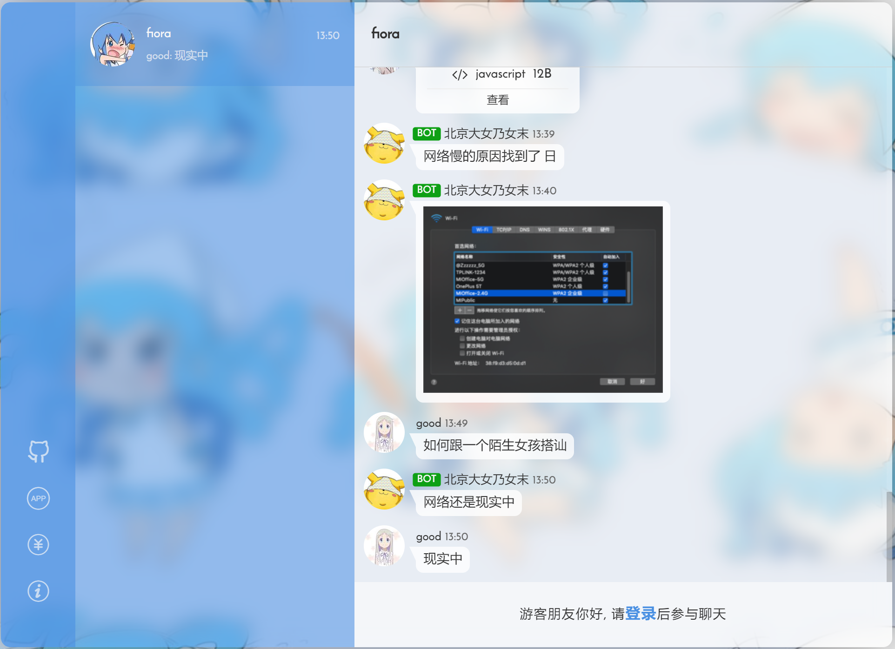
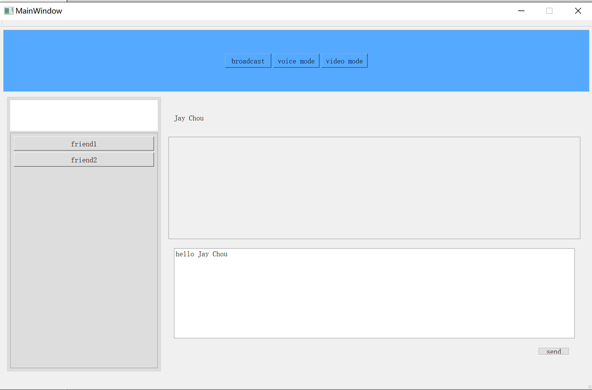
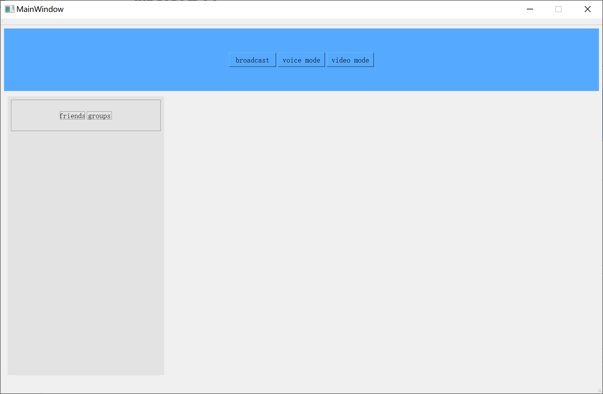
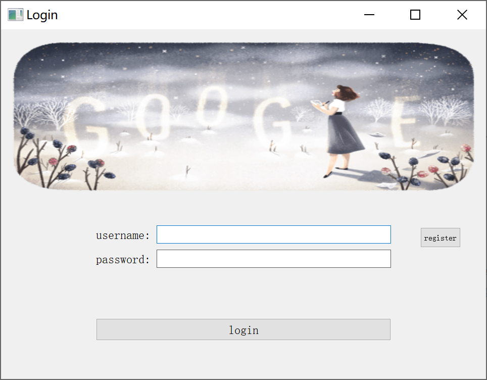
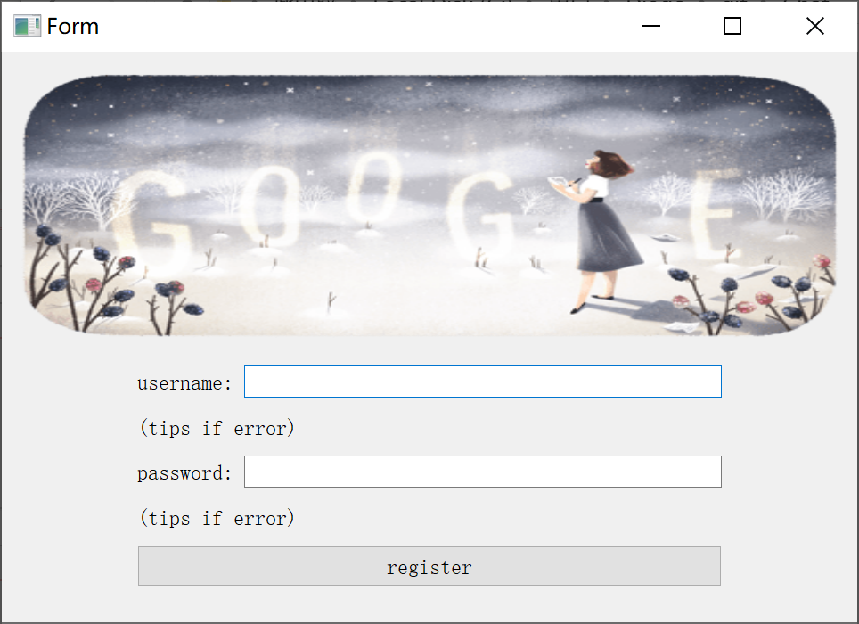

# 多功能聊天室 子项目：GUI实现

本项目为[多功能聊天室](https://github.com/wxq1999/versatile-chatroom)中的客户端GUI的实现

## 目标效果图

# 版本迭代

## version1.0

聊天页面

好友列表页面

### 当前完成部分

目前完成了聊天界面和好友列表界面的基础框架。

聊天界面可在多个聊天窗口间切换。

预留页面给未来可能新增的功能。

### 近期待完成

1. 文件读取

暂时尝试将数据从文件中读取，如好友信息，聊天记录等。完善接口，便于数据库接入后直接使用。

2. 好友列表完善

从文件中读取好友列表后，在列表中显示。

构造列表类以及其下的好友项，**单击**选取好友后能在右侧看到好友基本信息。

3. 动态添加聊天窗口页

目前聊天窗口的数目在初始化后是固定的。

欲实现**双击**好友列表中的好友，聊天界面动态新添与该好友的聊天框或者跳转到已有聊天窗口。

鼠标**移入**聊天界面，右侧显示一个小的关闭按钮。**点击**该按钮，左侧栏撤销该好友选项，同时右侧聊天界面消失。

4. GUI美化

许多小细节，如边框、不同部分间的空隙都需要调整。

## version1.1

初步完成了登录和注册界面

登陆界面

注册界面

